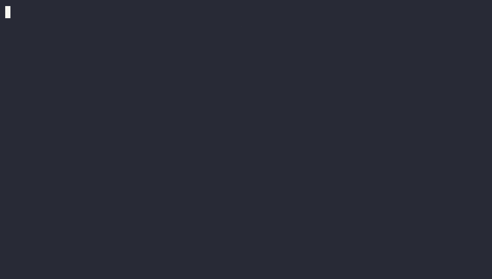

# swiftplay

[](https://github.com/JanicsJophles/swiftplay/actions/workflows/ci.yml)
[](./LICENSE)


Playwright-style UI automation for **native macOS apps**. swiftplay attaches to any
already-running app through the macOS Accessibility (AX) API — query its element
tree by role/label/text, drive the keyboard, and click controls — with no Xcode
project, no XCUITest, and no test bundle. It reads the app's live AX tree and
synthesizes input events, so it works against any pid / bundle id from the outside.



## Why swiftplay exists

swiftplay was built to test [**rackmind**](https://rackmind.ai) — an AI agent for
your homelab. rackmind's web and Electron surfaces get the full
[Playwright](https://playwright.dev) treatment, but its Mac app is native SwiftUI,
and Playwright can't drive that. The only sanctioned option there is XCUITest:
slow, flaky, Xcode-bound, with no working recorder for Mac targets and your tests
caged inside a test bundle.

So this is the tool we wished existed — Playwright's auto-waiting, locator-first
ergonomics, pointed at the native AppKit / SwiftUI layer instead. rackmind's Mac
app is still swiftplay's first real-world target; the dogfood suite that drives it
lives in [`examples/rackmind-macos/`](./examples/rackmind-macos/).

## Install

swiftplay builds from source, so you need **macOS 14+ and Xcode**.

**Homebrew:**

```sh
brew install janicsjophles/swiftplay/swiftplay
```

**From a clone:**

```sh
make install        # builds an optimized binary + puts `swiftplay` on your PATH
```

That installs to `/usr/local/bin`; install elsewhere with
`make install PREFIX="$HOME/.local"`. Prefer to run it in place without installing?
Build a debug binary and call it directly:

```sh
make build          # → .build/debug/swiftplay
```

`make` pins the build to Xcode's toolchain via `xcrun --toolchain XcodeDefault`,
because the `swift` on many machines is a swiftly-managed toolchain whose frontend
mismatches the macOS SDK and crashes the compiler. (Raw command, sans `make`:
`env -u TOOLCHAINS xcrun --toolchain XcodeDefault swift build --product swiftplay`.)

The examples below assume `swiftplay` is on your `PATH`. Not installed? Just prefix
them with the build path, e.g. `./.build/debug/swiftplay tree …`.

## Permissions

swiftplay drives the system through Accessibility, so the **terminal app that runs
it** must be granted Accessibility permission:

- System Settings → Privacy & Security → **Accessibility** → enable your terminal
  (Terminal.app, iTerm, etc.).

Screenshot / screen-capture features additionally require **Screen Recording**
permission for the same terminal.

There is **no programmatic way to grant these** — macOS (TCC) requires a manual
toggle. If swiftplay isn't trusted, commands print guidance and exit non-zero.

## Commands

All examples use the dogfood target bundle id `ai.rackmind.macos`.

### `launch` — start the app hidden (headless)

```sh
swiftplay launch -b ai.rackmind.macos
swiftplay launch --path /path/to/App.app
swiftplay launch -b ai.rackmind.macos --offscreen   # rendered but off-display (capturable)
swiftplay launch -b ai.rackmind.macos --show        # visible/foreground
```

Launches the target **hidden + in the background** (`open -g -j`): the window never
appears on screen and your current app keeps focus. AX queries and
`CGEvent.postToPid` still reach a hidden app, so swiftplay drives it fully headless
from there.

`--offscreen` makes the app **truly invisible while still rendering** — the mode
for a headless visual pass. It creates a *headless virtual display* (a real
display with no physical monitor, via the private `CGVirtualDisplay` API), moves
the window onto it, and holds it there for the session with a detached
`hold-display` process. The window renders normally — so `screenshot` captures
real content — but lives on a screen you can't see, with focus never moving. When
the app exits (or the holder is killed) the virtual display is torn down
automatically.

This is the native equivalent of a browser's offscreen compositor — the trick
that lets Playwright screenshot Electron headlessly. macOS only gives a window a
backing surface when it's on *some* display, so a hidden window is blank to
ScreenCaptureKit; a virtual display gives it one that isn't visible.

With `offscreen.retina` enabled (`swiftplay config set offscreen.retina true`),
the virtual display is switched to a 2× HiDPI mode so captures come out at full
retina resolution; otherwise it's 1×. The mode switch is scoped to the virtual
display alone — physical displays are never reconfigured.

Fallbacks, if the virtual display can't be created: park the window fully on a
secondary physical display, else tuck the unavoidable ~40px sliver into a corner
(macOS won't let a foreign window move *fully* off a physical display).

> `--offscreen` uses two private APIs (`CGVirtualDisplay` + `_AXUIElementGetWindow`)
> — the only place swiftplay reaches past the public AX/CGEvent/SCK surface. The
> driver is un-sandboxed and never ships via the Mac App Store, so that's fine.
> Moving the window to a separate *Space* would also work but is locked down
> without disabling SIP, which swiftplay won't ask you to do.

Use `--show` if you actually want to watch it (or need mouse `click` / menu
key-equivalents — see Background mode).

### `tree` — dump the AX element tree

```sh
swiftplay tree -b ai.rackmind.macos
swiftplay tree -b ai.rackmind.macos --show-geometry
```

### `inspect` — print the element under the mouse cursor

```sh
swiftplay inspect
```

### `find` — locate elements (assertion oracle)

```sh
swiftplay find -t "Dashboard"
swiftplay find -t skill-row-/monitor --role AXButton
swiftplay find -t "Dashboard" --count
```

`find` exits **non-zero when nothing matches**, so it doubles as a test
assertion — drop it in a script and a missing element fails the suite.

### `type` — type literal text into the focused element

```sh
swiftplay type "hello world"
swiftplay type "/" -b ai.rackmind.macos
swiftplay type "hello" -b ai.rackmind.macos --foreground
```

### `press` — press a named key or chord

```sh
swiftplay press down
swiftplay press tab
swiftplay press down --repeat 3
swiftplay press cmd+k -b ai.rackmind.macos --foreground
```

Accepts a named key (`down`/`up`/`left`/`right`/`tab`/`return`/`escape`/`space`/
`delete`), a single letter/digit, or a chord like `cmd+k` / `cmd+shift+p`.
`--repeat N` presses N times.

### `click` — click an element by text/role

```sh
swiftplay click -t "Dashboard"
swiftplay click -t skill-row-/monitor --role AXButton --ax
swiftplay click -t "Save" -b ai.rackmind.macos
```

`--ax` performs the element's AX press action instead of a mouse click (see
Background mode).

### `screenshot` — capture a window to PNG

```sh
swiftplay screenshot -b ai.rackmind.macos -o shot.png
swiftplay screenshot -b ai.rackmind.macos --window-title Settings -o settings.png
```

Captures a single window via ScreenCaptureKit — shadow-free, wallpaper-free, at
native (retina) pixel resolution. With no `--window-title` it grabs the largest
window (the main one). Combine with `click`/`type`/`press` for a full
drive-and-screenshot visual pass — no in-app harness needed.

Needs **Screen Recording** permission (separate from Accessibility — granted to
your terminal app; see Permissions). A window launched fully hidden (`launch`
without `--show`) may have no backing store to capture, so use `--show` for a
visual pass.

### `config` — view and change defaults (the control center)

```sh
swiftplay config list                              # every setting + value
swiftplay config get offscreen.mode
swiftplay config set offscreen.mode virtual        # virtual | secondary | corner
swiftplay config set offscreen.retina true         # 2× headless captures
swiftplay config set defaults.bundleId ai.rackmind.macos
swiftplay config set defaults.bundleId             # (no value resets it)
swiftplay config path                              # ~/.swiftplay/config.json
```

git-style get/set/list over `~/.swiftplay/config.json`. Commands read these
defaults: `offscreen.mode`/`offscreen.retina` drive `launch --offscreen`,
`defaults.bundleId` lets you drop `-b` on every command, and `screenshot.dir`
is where bare-filename screenshots land. The menu-bar app edits the same file.

### `test` — run test scripts and report

```sh
swiftplay test --dir examples/rackmind-macos
swiftplay test examples/rackmind-macos/smoke-nav.sh
swiftplay test --dir examples/rackmind-macos -v
```

A test is an executable script that exits 0 on success. `test` runs them
**serially** (they drive a single GUI app instance + shared state, so they can't
overlap), prints a `✓`/`✗` summary with durations, shows failing output (all
output with `-v`), and exits non-zero if any fail. This is the v0.4 MVP runner —
scripts today, native TS/Swift test files later.

### `mcp` — run as an MCP server (drive apps from an agent)

```sh
swiftplay mcp
```

Exposes swiftplay over the [Model Context Protocol](https://modelcontextprotocol.io)
as a stdio server, so an agent (Claude, etc.) can drive native macOS apps. It's a
dependency-free JSON-RPC 2.0 server speaking newline-delimited messages on
stdin/stdout (logs go to stderr). Tools:

| Tool | What it does |
|------|--------------|
| `swiftplay_launch` | Launch an app (hidden/background by default, or `show=true`) |
| `swiftplay_tree` | Dump the AX tree — the agent's equivalent of the DOM |
| `swiftplay_find` | Find elements by role/text; reports count + matches |
| `swiftplay_click` | AX-press (default) or mouse-click the first match |
| `swiftplay_type` | Type literal text into the focused element |
| `swiftplay_press` | Press a key or chord (`down`, `tab`, `cmd+k`, …) |

Register it with Claude Code:

```sh
claude mcp add swiftplay -- swiftplay mcp
```

Or in a `claude_desktop_config.json` / `mcp.json`:

```jsonc
{
  "mcpServers": {
    "swiftplay": {
      "command": "swiftplay",
      "args": ["mcp"]
    }
  }
}
```

GUI apps (e.g. Claude Desktop) launch with a minimal `PATH` and may not find
`swiftplay` — use its absolute path there (`command: "$(which swiftplay)"`).

The same Accessibility permission applies: the **process that hosts the MCP
server** (your terminal, or the agent app launching it) must be granted
Accessibility. AX-dependent tools return an error result with guidance if it
isn't, rather than crashing the server.

## Menu-bar control center

`swiftplay-menubar` is a tiny menu-bar app (no Dock icon) that reads and writes
the same `~/.swiftplay/config.json` the CLI uses — a visual front end for
`swiftplay config`. From its dropdown you can switch the offscreen mode, toggle
retina, see the configured default app and screenshot dir, watch whether a
headless session is live, stop that session, or open the config file to edit.

```sh
make menubar     # build + launch it (or run .build/debug/swiftplay-menubar)
```

Because it edits the shared config, anything you change here changes what
`swiftplay launch --offscreen` does on the next run — and CLI-side edits show up
the next time you open the menu.

## Background / headless mode

By default `type` and `press` deliver events via `CGEvent.postToPid`, and
`click --ax` performs the element's AX press action. None of these steal focus or
switch Spaces — swiftplay reads the AX tree and posts straight to the target
process, so you can keep working in another app (or park the target on another
macOS Space) while a suite runs against it.

For a **fully headless run** — the app never appears on screen at all — start it
with `swiftplay launch` (hidden + background) and drive it with the default
(non-`--foreground`) commands. macOS has no true headless display for GUI apps, but
a hidden app's windows remain in the AX tree and accept `postToPid` input, so this
is as close as it gets: `launch` → `type`/`press`/`find`/`click --ax`, all
invisible. The dogfood suite ([`skill-picker.sh`](./examples/rackmind-macos/skill-picker.sh))
runs this way and never brings the app forward.

Pass `--foreground` to bring the target app forward first. You need it for:

- mouse **`click`** (without `--ax`) — the global CGEvent mouse hit-test resolves
  against the frontmost window;
- **menu key-equivalents** like `⌘K` — they only route through NSApplication when
  the app is frontmost and the event hits the global HID tap.

## Known limitations

- Plain **`Tab` as a command key** is not delivered as a command via CGEvent — it
  reaches the focused field but doesn't trigger AppKit's `doCommandBy:` (e.g.
  command-completion). Use **`click --ax`** to perform the element's action
  instead. Arrow keys do route correctly.
- The full, current gotcha list lives in
  [`examples/rackmind-macos/FINDINGS.md`](./examples/rackmind-macos/FINDINGS.md).

## Dogfood + more

- Runnable end-to-end suite:
  [`examples/rackmind-macos/skill-picker.sh`](./examples/rackmind-macos/skill-picker.sh)
- Headless crash sweep (every surface, "didn't crash"):
  [`examples/rackmind-macos/smoke-nav.sh`](./examples/rackmind-macos/smoke-nav.sh)
- Headless **visual** sweep (every surface → PNG catalog, "rendered, here's proof"):
  [`examples/rackmind-macos/smoke-visual.sh`](./examples/rackmind-macos/smoke-visual.sh)
- Findings, gotchas, and what works today:
  [`examples/rackmind-macos/FINDINGS.md`](./examples/rackmind-macos/FINDINGS.md)

## Contributing

See [CONTRIBUTING.md](./CONTRIBUTING.md) — it covers the build command, the
Accessibility permission, and why CI can only build-check (TCC can't be granted on
a hosted runner). Bug reports want an AX-tree slice; new gotchas go in
[`FINDINGS.md`](./examples/rackmind-macos/FINDINGS.md).

## License

[Apache License 2.0](./LICENSE). Use it, fork it, build on it.
</content>
</invoke>
